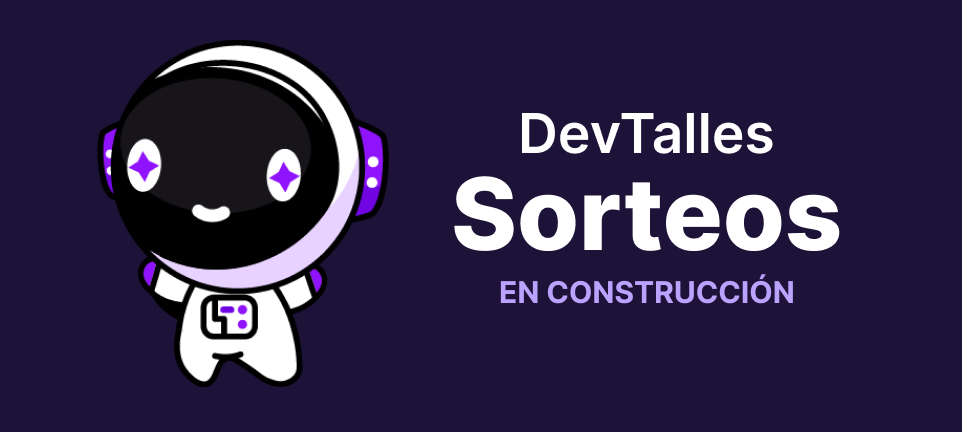

# 🚀 CODEQUEST 2024

- PSD: Desarrollado en tiempo libre
## 👋 Hola Mundo!
- Este es mi proyecto en el que asumiré el rol de FullStack, adentrándome en el desarrollo del backend. Es un desafío para el cual estoy preparada para seguir adelante y poner en práctica los conocimientos adquiridos en Next.js 14, así como también explorar el backend con Nest.js.
## 💜 Desafió de Pogramación
- Este emocionante proyecto surge como respuesta a un desafio propuesto por la comunidad de [Dev/Talles](https://cursos.devtalles.com/), liderada por [Fernando Herrera](https://fernando-herrera.com/).
- Puedes explorar los detalles de este desafio en el siguiente [enlace](https://twitter.com/DevTalles/status/1767255766853943584)
## 📂 Repositorios
- Explora el núcleo del desarrollo backend [aquí](https://github.com/) y sumérgete en las sorpresas del frontend [aquí](https://github.com/).
#### ¡Te invito a descubrir el alma de mi proyecto en cada línea de código!"
## 🔗 Enlaces
- Explora nuestro proyecto a través de nuestro diseño creativo en Figma [aquí](https://github.com/) y avances en la página web en producción [aquí](https://github.com/).
